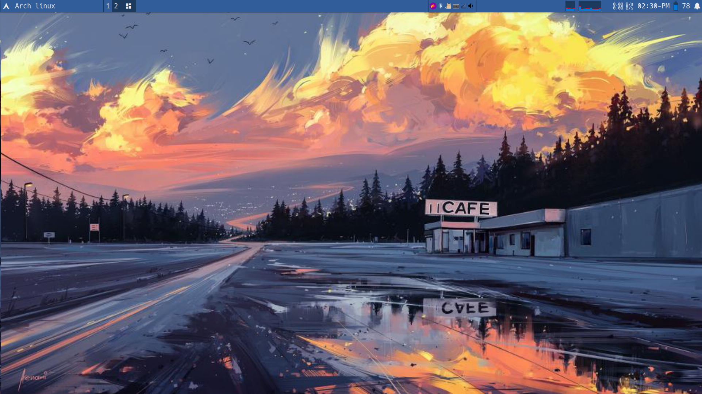
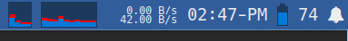
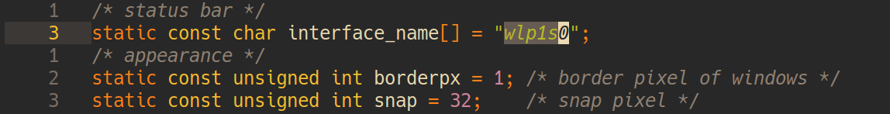
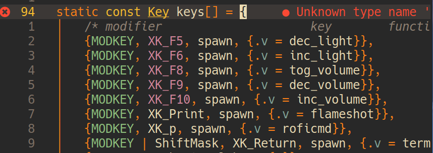

# steve的dwm,带有简单的状态栏，和简单的配色

- 该版本基于dwm-6.4更改，在源码中添加了一个线程用于更新和绘画状态栏。

## 展示

- 桌面



- 状态栏



## 安装

- hei,盆友们，现在我讲讲如何快速安装和应用dwm
- 首先如果你需要检测网速，你需要使用`ip a` ,查看你需要检测的网卡
- 将其添加到 config.h 中，并替换原有的 `interface_name` 的值


> 如果你觉得我的桌面还不错，那么你到这里配置就可以结束了

> 如果想自己更改配色，你可以到 config.h 中更改 `colors` 的值,操作跟配置dwm一样 😀

- 接下来我编译安装即可
```shell
sudo make clean install

```

## 使用
- 这边我大概讲解一下基础按键
> 提示：我的按键都基于`Super_L`为前缀，也就是我们常说的`WIN`
> 你也可以像我一样使用xmodmap将 大写锁定`Caps_Lock` 设置为`Super_L`

| 前缀    | 快捷键        | 说明          |
|---------|---------------|---------------|
| Super_L | Shift + Enter | 打开终端st    |
| Super_L | p             | 打开rofi      |
| Super_L | 数字键        | 切换workspace |
| Super_L | h/l           | 调节窗口宽度  |
| Super_L | j/k           | 切换窗口      |
| Super_L | Shift + q     | 退出dwm       |

- 我还添加了许多的快捷键，你可以在 config.h 中查看和更改

> 你可以看到我设置的快捷键，我建议你还是按照自己的习惯来设置

| 前缀    | 快捷键 | 说明                                        |
|---------|--------|---------------------------------------------|
| Super_L | F5/F6  | 减少/增加,屏幕亮度(需要你加入light的用户组) |
| Super_L | F8     | 切换是否🔇禁音                              |
| Super_L | F9/F10 | 减少/增加,音量                              |
| Super_L | Print  | 截屏（当然你要有flameshot）                 |

- 最后我们讲讲鼠标点击的快捷键

1. 使用左键，点击左上角，也就是title,会调出rofi
2. 使用右键，点击左上角，也就是title，会打开终端

3. 使用左键，(多点几次就+5n)点击右上角的铃铛图标，会显示出5条最近的消息(当然你要有dunst)
4. 使用右键，点击右上角的铃铛图标，会关闭消息
5. 用鼠标中键，点击右上角的铃铛图标，会清除消息记录
6. 右上角的铃铛图标,滑动鼠标滚轮也会有效的哦～

7.点击两个显示cpu负载的，会打开一个图形化的监视器

> 当然我只是介绍，你完全可以自定义,我也希望你这么做，不过我的代码有点烂，祝你好运，可以从Blocks看

> 我有打systray的补丁，所以我建议你使用各种各样的applet,比如我现在使用的:

> - nm-applet
> - blueman-applet
> - pa-applet

